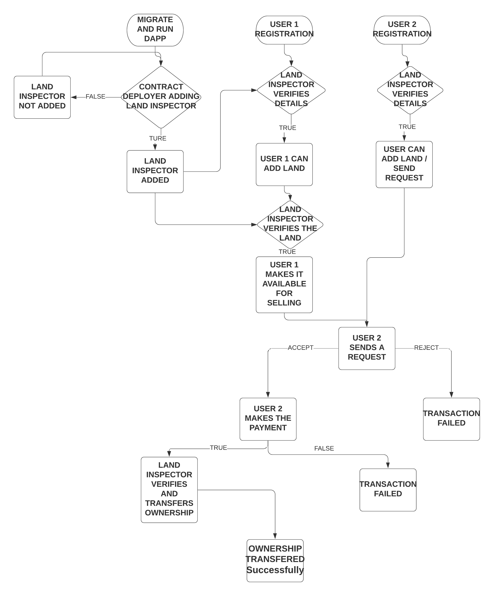
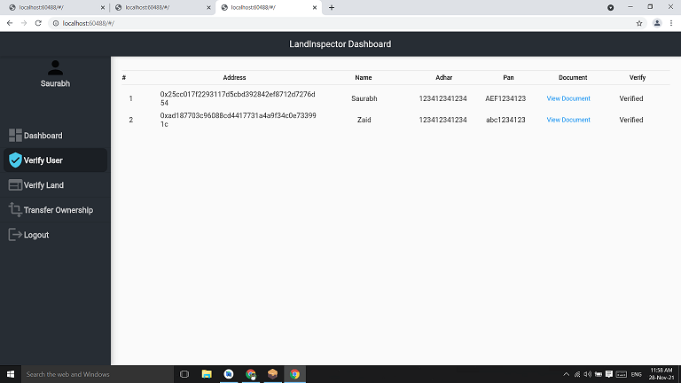
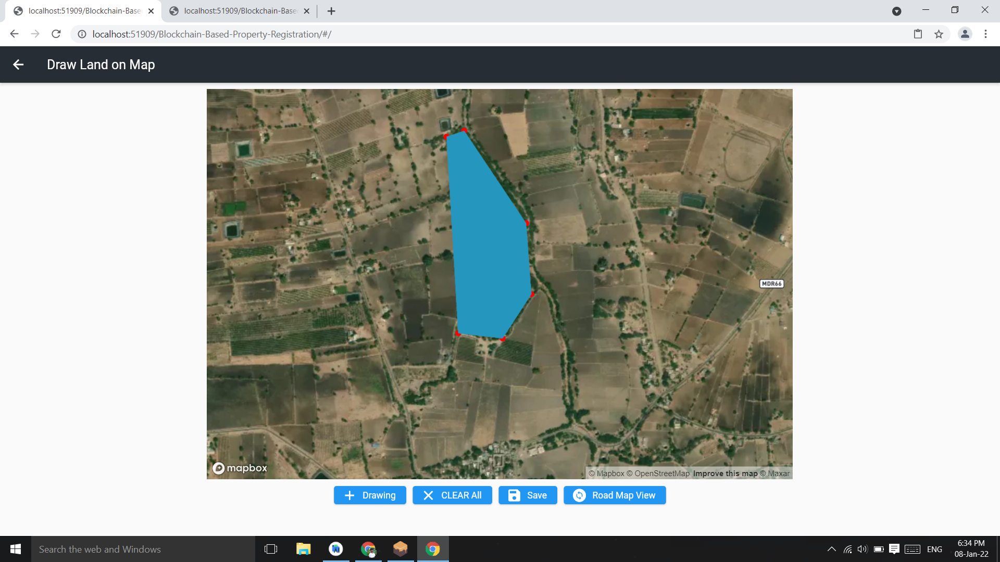
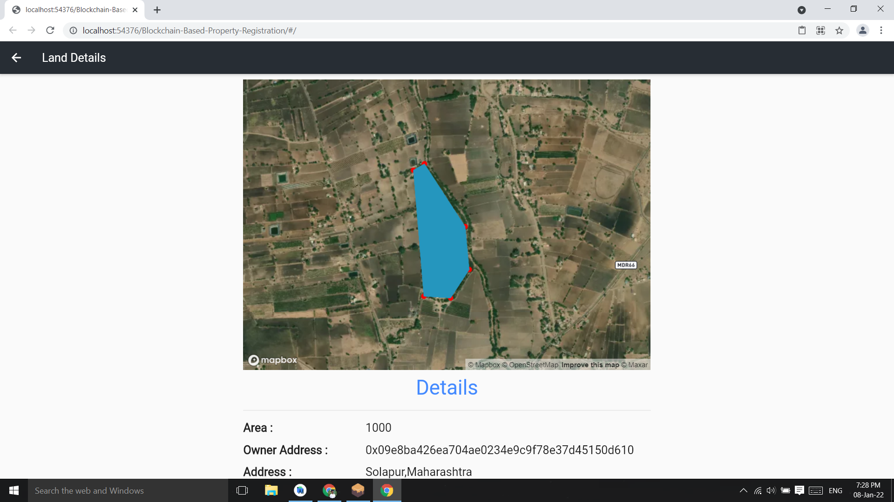
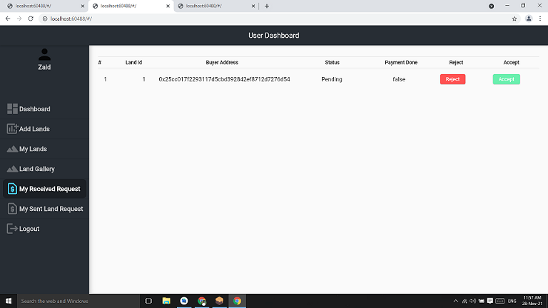

# Blockchain-Based Property Registration

<a href="LICENSE"></a>


## Overview
This project provides a decentralized solution for land registration using blockchain technology. It addresses the following issues:
1. **Elimination of Middlemen**: Reduces costs and fraud by removing brokers and speeding up the registration process.
2. **Tamper-Proof Ledger**: Utilizes a distributed ledger to prevent ownership fraud.
3. **Secure Document Storage**: Stores important property registration documents securely using IPFS.

## Technology Stack
- Ethereum Blockchain
- Polygon/Matic
- Web3Dart
- IPFS
- Flutter
- Metamask

## Demo
Watch a demonstration of our Dapp [here](https://www.youtube.com/watch?v=IMkCFsI3ePA).


## Running Locally
1. Clone the repository and navigate to the project folder.
2. Install Flutter 3.0.2 and Node.js.
3. Install Ganache and Truffle:
   ```bash
   npm install -g truffle
   ```
4. Run Ganache in the background.
5. Install the Metamask Chrome extension, select the local network, and import the accounts.
6. Compile and deploy migrations:
   ```bash
   truffle compile
   truffle migrate
   ```
7. Update the `constant.dart` file with the new contract address:
   ```text
   contract address: 0xed690C24C60A48F8A9819c9A15AD75B70CFBEa5a
   ```
   Set `chainId` to `'1337'` and `rpcUrl` to `"http://127.0.0.1:7545"`.
8. Run the Flutter web app:
   ```bash
   flutter pub get
   flutter run -d web-server --web-port 5555
   ```
9. Access the Dapp at [http://localhost:5555/](http://localhost:5555/).
10. Obtain a Mapbox API key from [Mapbox](https://www.mapbox.com/) and replace the `mapBoxApiKey` in the `constant.dart` file.

## Project Flowchart


## Screenshots
- **Home Page** | **Wallet Connect/Login**
   | 
- **Contract Owner Dashboard** | **User Registration**
   | 
- **Land Inspector Dashboard** | **User Verification**
   | 
- **User Dashboard** | **Adding Land on Map**
   | 
- **Land Gallery** | **Land Details**
   | 
- **Received Request** | **Make Payment**
   | 
- **Transfer Ownership/Seller/Buyer Photo Capture** | **Witness Info/Photo Capture/Transfer Ownership**
   | 